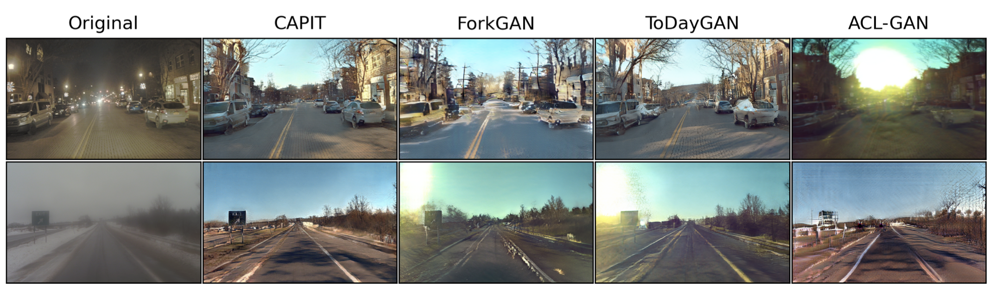
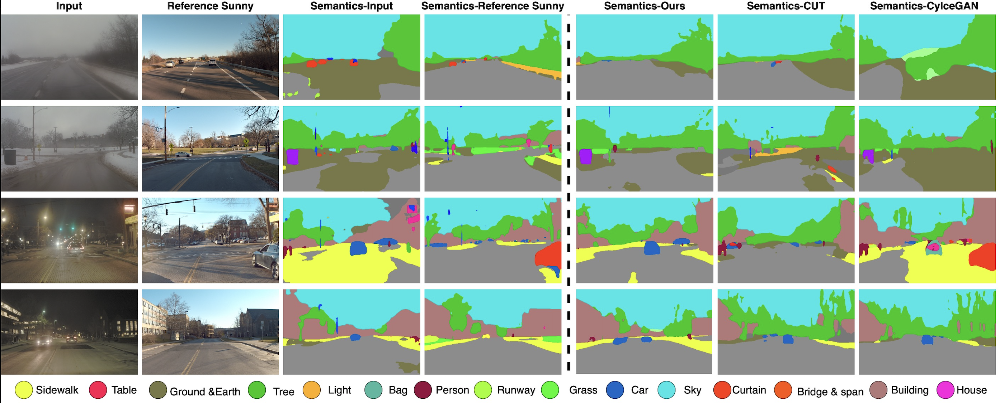

# Coarsely-Aligned Paired Image Translation (CAPIT)


We provide our PyTorch implementation of Coarsely-Aligned Paired Image Translation (CAPIT) which has been accepted to ICRA 2023.

## Prerequisites
- Linux or macOS
- Python 3
- CPU or NVIDIA GPU + CUDA CuDN

### Getting started

- Clone this repo:
```bash
git clone https://github.com/xiaxx244/Adv2Sunny CUT
cd CAPIT
```

- Install PyTorch 1.1 and other dependencies (e.g., torchvision, visdom, dominate, gputil).

  For pip users, please type the command `pip install -r requirements.txt`.

  For Conda users,  you can create a new Conda environment using `conda env create -f environment.yml`.

- Prepare the dataset
  - First, find or create a coarsely aligned dataset in the path CAPIT/paired_A/ and CAPIT/paired_B respectively (paired_A stores images in the source  domain, paired_B stores images in the target domain.
  - Then, mask the corasely aligned images by using [Detectron2](https://github.com/facebookresearch/detectron2) and store the mask results in two folders called tmp_data/A and tmp_data/B respectively (already provide a file calld mask_img.py which can help mask the image)
  -Aferwards. create a train and test split under tmp_data/A and tmp_data/B respectively.
  - Finally store the train, test split of the masked version of corasely aligned dataset in a folder under CAPIT called mask_data by using the following command:
    ```bash
    python datasets/combine_A_and_B.py --fold_A tmp_data/A --fold_B tmp_data/B --fold_AB mask_data
    ```
   - Note: The folders in the mask_data should be: trainA, trainB, testA, testB.
  
- Train the CAPIT model:
```bash
python train.py --dataroot  mask_data/ --name weather_cutoriloc --CUT_mode CUT --display_id 0 --preprocess scale_width --load_size 512

```
- Test the CAPIT model:
```bash
python test.py --dataroot mask_data/  --name weather_nightcutrank --CUT_mode CUT --preprocess scale_width --load_size 512
```
## Semantic Segmentation Results of Translated Image 


## Acknowledgements
- https://github.com/taesungp/contrastive-unpaired-translation
- https://github.com/junyanz/pytorch-CycleGAN-and-pix2pix
